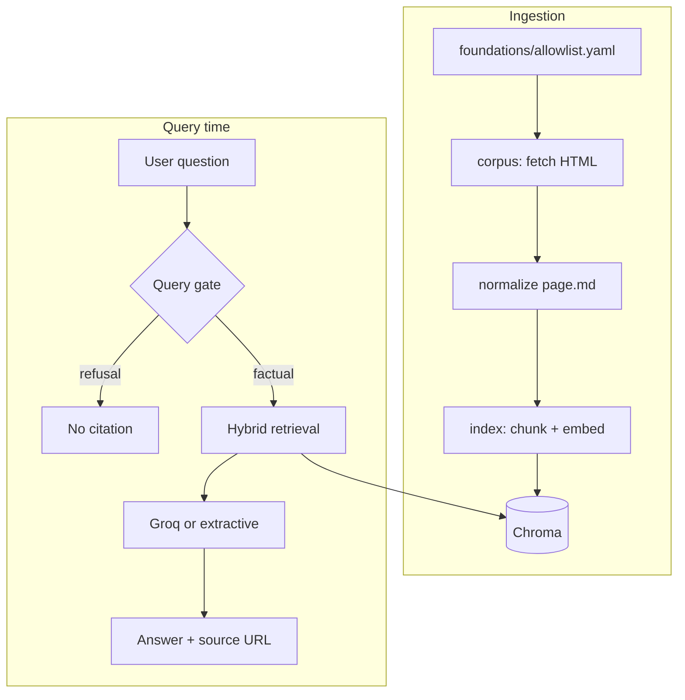

# MS02 — HDFC Mutual Fund FAQ Assistant (Facts-Only)

A lightweight **RAG** assistant that answers objective questions about **five HDFC mutual fund schemes** using text ingested from fixed Groww scheme pages. It refuses investment advice, never collects PII, and cites exactly one allowlisted source URL on factual answers.

**Disclaimer:** Facts-only. No investment advice.

---

## Selected AMC and schemes

| Scheme | Category (illustrative) | Source (allowlisted) |
|--------|-------------------------|----------------------|
| HDFC Mid Cap Fund Direct Growth | Mid cap | [Groww page](https://groww.in/mutual-funds/hdfc-mid-cap-fund-direct-growth) |
| HDFC Equity Fund Direct Growth | Flexi / multi cap | [Groww page](https://groww.in/mutual-funds/hdfc-equity-fund-direct-growth) |
| HDFC Focused Fund Direct Growth | Focused | [Groww page](https://groww.in/mutual-funds/hdfc-focused-fund-direct-growth) |
| HDFC ELSS Tax Saver Direct Plan Growth | ELSS | [Groww page](https://groww.in/mutual-funds/hdfc-elss-tax-saver-fund-direct-plan-growth) |
| HDFC Large Cap Fund Direct Growth | Large cap | [Groww page](https://groww.in/mutual-funds/hdfc-large-cap-fund-direct-growth) |

Canonical allowlist: `phases/foundations/allowlist.yaml` (exactly **five** URLs).

---

## Repository layout

```
ms_02/
├── app.py                         # Streamlit Cloud entry
├── requirements.txt               # Deploy dependencies (Streamlit + RAG)
├── README.md                      # This file
├── phased-architecture.md         # Design reference (phases 0–5)
├── docs/
│   └── edge-cases/                # Per-phase edge-case catalogs (phase 0–5)
├── scripts/
│   ├── setup_local.sh             # one-time venv + deps
│   ├── run_local.sh               # localhost UI + API
│   └── refresh-corpus-index.sh    # Scheduled ingest + index rebuild
├── phases/
│   ├── ms02_paths.py              # Canonical folder paths
│   ├── foundations/               # Allowlist, policy checklist
│   ├── corpus/                    # Scrape + normalize (ms02_corpus)
│   │   ├── raw/ intermediate/ normalized/
│   │   └── scripts/run_ingestion.sh
│   ├── index/                     # Chunks, embeddings, vector store
│   │   └── scripts/run_index_build.sh
│   ├── answer_engine/             # RAG + refusals (ms02_answer)
│   ├── ui/                        # Streamlit app (+ optional API)
│   │   ├── app.py
│   │   ├── backend/ frontend/
│   │   └── scripts/run_app.sh
│   └── quality/                   # Golden tests, runbooks (ms02_hardening)
│       └── scripts/run_quality_gates.sh
└── .github/workflows/
    ├── refresh-corpus-index.yml
    └── quality-gates.yml
```

---

## Architecture (RAG)



Details: [`phased-architecture.md`](phased-architecture.md). Per-phase edge-case catalogs: [`docs/edge-cases/`](docs/edge-cases/).

---

## Quick start (localhost first)

```bash
# 1) One-time setup (venv + deps + .env)
./scripts/setup_local.sh

# 2) Build corpus + index (first time, or to refresh data)
./scripts/refresh-corpus-index.sh

# 3) Start Streamlit UI (+ optional API)
./scripts/run_local.sh
```

| Service | Local URL |
|---------|-----------|
| **Streamlit UI** | http://127.0.0.1:8501/ |
| **REST API** (optional) | http://127.0.0.1:8000/api/ask |
| **API docs** | http://127.0.0.1:8000/docs |

Streamlit only: `MS02_SKIP_API=1 ./scripts/run_local.sh`  
UI only: `./phases/ui/scripts/run_app.sh`

Optional: add `GROQ_API_KEY` to `.env` for LLM answers (extractive fallback works without it).

```bash
./phases/quality/scripts/run_quality_gates.sh   # before deploy
```

---

## Deploy (Streamlit Cloud)

After localhost works:

1. Push repo (include `phases/index/vector_store/` and `phases/corpus/normalized/`).
2. [share.streamlit.io](https://share.streamlit.io) → **New app** → main file: `app.py`, requirements: `requirements.txt`.
3. Secrets: `GROQ_API_KEY` (optional).

See `docs/deployment/streamlit-deploy-plan.md` and `phases/quality/runbooks/streamlit-deploy.md`.

---

## Scheduled data refresh

GitHub Actions: `.github/workflows/refresh-corpus-index.yml` — daily **10:00 IST** (04:30 UTC).

---

## Known limitations

- Data is refreshed on schedule; “last updated” reflects Groww page ingestion, not AMC/AMFI primary documents.
- Only five allowlisted scheme pages are in scope.
- Groq RAG is chunk-grounded; hallucination risk is reduced, not eliminated.

---

## Disclaimer snippet

`phases/quality/disclaimer/disclaimer.txt` — **Facts-only. No investment advice.**
