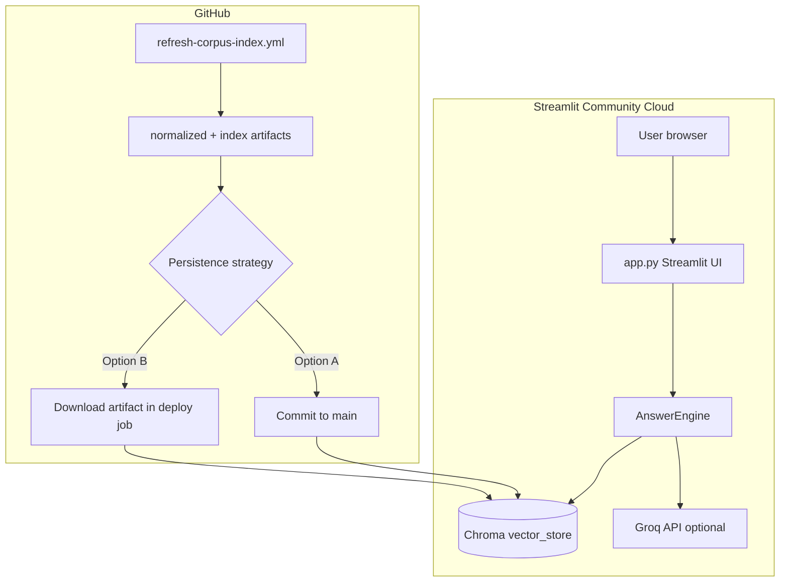

# Streamlit deployment plan — MS02 HDFC Mutual Fund FAQ

This plan covers deploying **MS02** to [Streamlit Community Cloud](https://share.streamlit.io) while keeping the existing RAG stack (`phases/corpus`, `phases/index`, `phases/answer_engine`) and **GitHub Actions** refresh pipeline unchanged.

**Current state:** Phase 4 UI is **Streamlit** (`phases/ui/app.py`, repo-root `app.py`) with optional FastAPI/static UI for local API testing.

---

## 1. Goals and constraints

| Goal | Approach |
|------|----------|
| Public demo URL | Streamlit Community Cloud |
| Facts-only UI (disclaimer, examples, chat) | `streamlit` app calling `AnswerEngine` in-process |
| No PII collection | No forms for email/phone/PAN; `AskBody`-style question-only input |
| Fresh corpus/index | Keep `.github/workflows/refresh-corpus-index.yml` (daily 10:00 IST) |
| Quality gate before release | `./phases/quality/scripts/run_quality_gates.sh` |

| Constraint | Implication |
|------------|-------------|
| Streamlit Cloud has no cron | Scheduled ingest/index rebuild stays in **GitHub Actions**, not on Streamlit |
| Cold start / memory | First query may be slow (HF model + Chroma load); cache `AnswerEngine` with `@st.cache_resource` |
| Secrets | `GROQ_API_KEY` only in Streamlit Secrets / GitHub Secrets — never in git |
| Repo size | Commit **index artifacts** (~22 MB `vector_store/`) or accept long first-boot rebuild |

---

## 2. Target architecture (Streamlit Cloud)



**Runtime path:** User → Streamlit → `AnswerEngine.ask()` → query gate → hybrid retrieval → Groq or extractive → validated JSON-shaped result → Streamlit renders answer + single source link + “Last updated from sources”.

**Not deployed on Streamlit:** FastAPI is optional for cloud demo; keep it for local/API testing only.

---

## 3. Prerequisites

### 3.1 Repository

- [ ] GitHub repo (public for free Streamlit Community Cloud, or Team plan for private).
- [ ] `main` branch stable; CI green (`quality-gates.yml`).
- [ ] Index built at least once locally or via Actions:
  - `phases/index/index_build.json`
  - `phases/index/vector_store/` (Chroma)
  - `phases/corpus/normalized/**/page.md`

### 3.2 Accounts

- [ ] GitHub account linked to Streamlit Cloud.
- [ ] [Groq console](https://console.groq.com) API key (optional; extractive fallback works without it).

### 3.3 Local validation (before cloud)

```bash
./scripts/setup_local.sh
./scripts/refresh-corpus-index.sh    # if index missing
./phases/quality/scripts/run_quality_gates.sh
```

---

## 4. Code changes required (re-add Streamlit layer)

The following were removed when reverting to FastAPI; restore or recreate for Streamlit deploy.

| Artifact | Purpose |
|----------|---------|
| `app.py` (repo root) | Streamlit Cloud **Main file** — thin wrapper: `runpy.run_path("phases/ui/app.py")` |
| `phases/ui/app.py` | Streamlit UI: sidebar disclaimer, example chips, chat, calls `AnswerEngine` |
| `requirements.txt` (root) | `-r` corpus/index/answer_engine + `streamlit>=1.32,<2` |
| `.streamlit/config.toml` | Theme, `server.headless = true`, max upload size |
| `.streamlit/secrets.toml.example` | Document `GROQ_API_KEY` for local dev only |
| `phases/ui/scripts/run_app.sh` | Local: `streamlit run app.py` |
| `scripts/run_local.sh` | Optional: Streamlit :8501 + API :8000, or Streamlit-only |
| Quality check | `check_streamlit_disclaimer` on `phases/ui/app.py` (or keep dual check for HTML + Streamlit) |
| `phases/quality/runbooks/streamlit-deploy.md` | Short operator runbook (smoke + rollback) |
| `README.md` + `phased-architecture.md` | Phase 4 section: Streamlit primary, FastAPI optional |

### 4.1 `phases/ui/app.py` — functional requirements

1. **`@st.cache_resource`** singleton `AnswerEngine` (avoid reload per message).
2. **`_apply_streamlit_secrets()`** — map `st.secrets["GROQ_API_KEY"]` → `os.environ` (Cloud); local uses `.env` via `python-dotenv` if present.
3. **Disclaimer** always visible: `Facts-only. No investment advice.`
4. **Three+ example questions** as buttons (problem statement).
5. **Render** `answer`, optional `st.link_button` for `source_url`, footer for `last_updated`.
6. **No PII fields** in UI.
7. Set `PYTHONPATH` or `sys.path` for `phases/corpus`, `phases/index`, `phases/answer_engine` (same as backend).

### 4.2 Root `requirements.txt` (deploy)

```text
-r phases/corpus/requirements.txt
-r phases/index/requirements.txt
-r phases/answer_engine/requirements.txt
streamlit>=1.32,<2
```

Do **not** include FastAPI/uvicorn unless you also want API on a second host.

### 4.3 `.gitignore`

Keep:

```gitignore
.env
.streamlit/secrets.toml
phases/index/.venv/
```

Ensure **`phases/index/vector_store/`** and **`phases/corpus/normalized/`** are **tracked** (not ignored) if using “commit index” strategy.

---

## 5. Data and index persistence (choose one)

| Strategy | Pros | Cons | Recommended for MS02 |
|----------|------|------|----------------------|
| **A. Commit full index** | Fast cold start; no rebuild on Cloud | ~22 MB+ in repo; manual or bot commit after refresh | **Yes** — simplest for demo |
| **B. Commit `normalized/` only** | Smaller git diffs | Rebuild index on each deploy / boot (slow, may OOM) | Dev only |
| **C. Artifacts only** | CI proves freshness | Extra deploy job to push artifacts to branch | Advanced / production |

### 5.1 Recommended: Strategy A + scheduled refresh

1. **GitHub Actions** runs daily (`refresh-corpus-index.yml`).
2. After green run, either:
   - **Manual:** download artifact → commit `normalized/`, `vector_store/`, manifests; push `main`, or
   - **Automated (phase 2):** add workflow job with `contents: write` to commit refresh outputs (protect `main` with review if needed).
3. Streamlit Cloud **Reboot app** or auto-redeploy on push to `main`.

### 5.2 Hugging Face model on Cloud

- Embedding model: `sentence-transformers/all-MiniLM-L6-v2`.
- Set `HF_HOME` in app startup to a path under the repo, e.g. `phases/index/.cache/huggingface` (optional pre-cache in repo is usually **not** worth 87 MB — let Cloud download once per instance).
- Use `@st.cache_resource` so model loads once per container lifetime.

---

## 6. Streamlit Cloud setup (step-by-step)

### Phase 1 — Prepare branch

1. Implement Section 4 files on branch `feature/streamlit-deploy`.
2. Commit index + normalized data:
   ```bash
   git add phases/corpus/normalized phases/index/vector_store phases/index/index_build.json
   git add app.py requirements.txt .streamlit/ phases/ui/app.py
   git commit -m "Add Streamlit deploy entrypoint and committed index"
   ```
3. Push and open PR; merge after `quality-gates` passes.

### Phase 2 — Create app on Streamlit Cloud

1. Go to [share.streamlit.io](https://share.streamlit.io) → **Create app**.
2. **Repository:** your `ms_02` GitHub repo.
3. **Branch:** `main`.
4. **Main file path:** `app.py`.
5. **App URL:** choose subdomain (e.g. `ms02-hdfc-faq`).
6. **Advanced settings → Python version:** **3.11** (match Actions).
7. Save — first build installs `requirements.txt` (expect 5–15 minutes).

### Phase 3 — Secrets

In app **Settings → Secrets**:

```toml
GROQ_API_KEY = "gsk_..."
# Optional:
# GROQ_MODEL = "llama-3.1-8b-instant"
# MS02_USE_GROQ = "1"
```

Redeploy after saving secrets.

### Phase 4 — Verify

| Check | Expected |
|-------|----------|
| App loads | Disclaimer visible |
| Example question | Factual answer, one Groww URL |
| Advisory question | Refusal, **no** URL |
| PII-shaped question | Refusal, **no** URL |
| Logs | No raw user PII logged |

Example smoke question: *What is the minimum SIP for HDFC ELSS Tax Saver Direct Plan Growth?*

---

## 7. CI/CD integration

| Workflow | Role in Streamlit deploy |
|----------|---------------------------|
| `refresh-corpus-index.yml` | Refreshes corpus + index; **does not** deploy Streamlit |
| `quality-gates.yml` | Blocks bad merges (golden, red-team, disclaimer) |

### Optional: deploy-on-green workflow

Add `.github/workflows/streamlit-data-sync.yml` (future):

- `workflow_run` after successful refresh **or** weekly cron.
- Job: checkout → download previous artifact / use workspace outputs → commit index paths → push to `deploy-data` branch or `main`.
- Streamlit watches `main` and redeploys.

**Do not** run corpus crawl inside Streamlit Cloud (timeouts, no outbound scrape policy risk).

---

## 8. Pre-deploy checklist

- [ ] `index_build.json` present and `ok: true`
- [ ] All five schemes in `phases/corpus/normalized/`
- [ ] `validate_allowlist.sh` passes
- [ ] `run_quality_gates.sh` passes locally
- [ ] Streamlit app shows disclaimer + examples
- [ ] `GROQ_API_KEY` in Streamlit Secrets (if using LLM path)
- [ ] No secrets in git (`git grep GROQ_API_KEY` clean)
- [ ] README documents public URL and limitations

---

## 9. Post-deploy operations

| Task | Action |
|------|--------|
| **Rollback** | Streamlit → Manage app → **Reboot** previous version, or revert Git commit and wait for redeploy |
| **Stale answers** | Check last `refresh-corpus-index` run; re-commit index; reboot app |
| **Groq errors** | Confirm secret; app falls back to extractive if configured |
| **OOM / slow boot** | Reduce `top_k`; ensure `@st.cache_resource`; consider dropping Groq on free tier |
| **Monitor refresh** | GitHub Actions notifications + `phases/quality/runbooks/crawl-failure.md` |

---

## 10. Risks and mitigations

| Risk | Mitigation |
|------|------------|
| Streamlit sleep (free tier) | Accept cold start; show `st.spinner` on first question |
| Index out of sync with corpus | Tie data commits to successful refresh workflow |
| LLM hallucination | Keep validator + retrieval grounding; document limitation in README |
| Groww page unavailable | Workflow fails; do not deploy broken index |
| Dual UI maintenance | Streamlit = cloud demo; FastAPI static = local/API tests — document clearly |

---

## 11. Suggested timeline

| Week | Deliverable |
|------|-------------|
| **W1** | Restore `app.py`, `phases/ui/app.py`, requirements; local `streamlit run app.py` |
| **W1** | Re-enable quality `streamlit_disclaimer` check; update README |
| **W2** | Commit index + normalized; first Streamlit Cloud deploy |
| **W2** | Smoke tests + handoff sign-off (`HANDOFF.md`) |
| **W3** | Optional: auto-commit refresh outputs to `main`; monitor 7 daily refreshes |

---

## 12. FastAPI vs Streamlit (decision record)

| | **Streamlit Cloud** | **Current FastAPI + static** |
|--|---------------------|------------------------------|
| Hosting | share.streamlit.io | Railway / Render / Fly / local |
| Best for | Quick public demo, minimal front-end code | Single port, custom HTML/CSS, REST clients |
| API | Not primary | `POST /api/ask` built-in |

**Recommendation:** Use **Streamlit** for the graded/public demo URL; keep **FastAPI** in repo for local dev and API golden tests (`phases/ui/backend/tests/`).

---

## 13. References

- [Streamlit Cloud docs](https://docs.streamlit.io/streamlit-community-cloud)
- [Streamlit secrets](https://docs.streamlit.io/develop/concepts/connections/secrets-management)
- Repo: `phased-architecture.md`, `phases/quality/HANDOFF.md`, `phases/foundations/allowlist.yaml`
