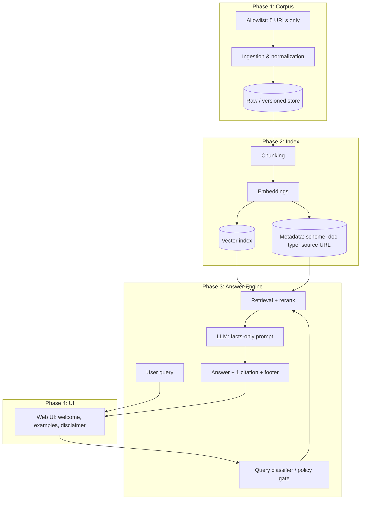
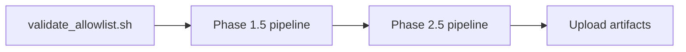

# Phased Architecture: Mutual Fund FAQ Assistant (Facts-Only RAG)

This document describes a phased architecture aligned with the Mutual Fund FAQ Assistant problem statement: facts-only Q&A, RAG-based retrieval, strict refusal of advice, and a minimal UI. **For this build, the corpus and citations are restricted to exactly five fixed Groww scheme URLs** (see Phase 0)—no other URLs are ingested, indexed, or cited.

---

## High-Level System View



---

## Phase 0: Foundations and Compliance

**Goals:** Lock constraints before build; avoid rework on privacy and content policy.

| Area | Decisions |
|------|-----------|
| **Data** | Single AMC (**HDFC**); **five** schemes. **Allowlist rule:** ingest, store, index, and cite **only** the five Groww URLs in the table below—**no other URLs** (no extra scheme pages, no AMC PDFs, no AMFI/SEBI pages, no link-following to other domains for corpus or citations). |
| **PII** | No collection or persistence of PAN, Aadhaar, accounts, OTPs, email, phone. |
| **Content** | No advice, no comparisons, no return math; performance-heavy questions → answer only from retrieved content on the allowlisted pages, and cite **one of those five URLs** (typically the relevant scheme page). |
| **Output contract** | Max 3 sentences. **Citation URL only on the factual path** when the answer is grounded in retrieved allowlisted text: exactly **one** `source_url` from the five URLs, plus footer `Last updated from sources: <date>`. **No URL** on refusals, PII-related handling, insufficient context, or unknown/out-of-scope answers. |

**Complete URL allowlist (only sources in this project):**

| Scheme (Groww slug) | URL |
|----------------------|-----|
| HDFC Mid Cap Fund Direct Growth | https://groww.in/mutual-funds/hdfc-mid-cap-fund-direct-growth |
| HDFC Equity Fund Direct Growth | https://groww.in/mutual-funds/hdfc-equity-fund-direct-growth |
| HDFC Focused Fund Direct Growth | https://groww.in/mutual-funds/hdfc-focused-fund-direct-growth |
| HDFC ELSS Tax Saver Fund Direct Plan Growth | https://groww.in/mutual-funds/hdfc-elss-tax-saver-fund-direct-plan-growth |
| HDFC Large Cap Fund Direct Growth | https://groww.in/mutual-funds/hdfc-large-cap-fund-direct-growth |

There are **no** additional seed, redirect, or “official PDF” URLs in scope: the fetcher does not follow outbound links to build the corpus, and the assistant does not cite URLs outside this list.

**Deliverables:** Allowlist file (e.g. YAML) mirroring exactly this table; content policy checklist; red-team query list (advisory vs factual). **Implemented in repo:** `phases/foundations/` (`allowlist.yaml`, `content-policy-checklist.md`, `red-team-queries.yaml`, `validate_allowlist.sh`).

---

## Phase 1: Corpus Pipeline (Ingestion)

**Goals:** Build a reproducible corpus from **exactly** the five allowlisted Groww HTML pages—nothing else.

### Phase 1 subphases (implement in order)

| Subphase | Objective | Done when |
|----------|------------|-----------|
| **1.1** — Allowlist & registry | Load the closed allowlist (e.g. `phases/foundations/allowlist.yaml`); validate **exactly five** URLs match Phase 0; expose a single in-code or config object used by all later subphases. | Registry module/script fails fast if count ≠ 5, duplicate URLs, or unknown URL strings. |
| **1.2** — Raw fetcher | HTTP **GET** each allowlisted URL only; respectful defaults (user-agent, timeouts, simple retries/backoff); **no** redirects to off-allowlist hosts, no recursive fetch, no PDF branch. | Five raw HTTP payloads (or clear per-URL error records) written under the corpus `raw/` area; no extra hosts in access logs. |
| **1.3** — HTML extraction | Turn each raw HTML snapshot into **main page content** (strip nav, chrome, repeated boilerplate; minimize script/style noise) without following outbound links for “more content.” | One extracted document per URL suitable for normalization (intermediate OK: e.g. cleaned HTML fragment). |
| **1.4** — Normalization | Produce **plain text or Markdown** per scheme; attach metadata: `source_url` (must ∈ allowlist), `fetched_at`, content **hash** aligned with stored raw snapshot. | Five normalized files (or records) under `normalized/` (or equivalent) with correct provenance fields. |
| **1.5** — Job wrapper & exit criteria | Single command or job (e.g. CLI / script) runs **1.1→1.4** in sequence; supports **re-crawl** idempotently; wires automated allowlist checks (reuse or extend `validate_allowlist.sh` / CI). Invoked on a schedule by **GitHub Actions** (see [Scheduled refresh](#scheduled-refresh-github-actions)). | On demand: all five URLs succeed end-to-end OR the job exits non-zero with actionable errors; re-run reproduces corpus from the same allowlist only. |

Implement **one subphase at a time**; treat each row as a mergeable increment before starting the next.

**Components**

1. **URL registry** — Closed allowlist: **only** the five URLs in Phase 0; reject any config or job that adds another URL.
2. **Fetcher** — Respectful HTTP client (robots.txt, rate limits, user-agent); **GET only** the five pages; no recursive crawl, no PDFs, no following links off the allowlist for ingestion.
3. **Extractors** — HTML main-content stripping (minimize chrome/nav); no PDF pipeline required for this scope.
4. **Normalization** — Plain text or structured markdown per page; tag each chunk with its **single** `source_url` from the allowlist.

**Storage:** Object store or filesystem for raw HTML snapshots; metadata includes `fetched_at`, content hash, and `source_url` ∈ allowlist.

**Exit criteria:** All **five** URLs successfully ingested on demand; re-crawl job reproduces corpus from the same allowlist only; automated check fails the build if the registry size ≠ 5 or any URL is not in the Phase 0 table.

---

## Phase 2: Retrieval Index (RAG Core)

**Goals:** Enable accurate factual retrieval with traceability to a single canonical source per answer.

### Phase 2 subphases (implement in order)

| Subphase | Objective | Done when |
|----------|------------|-----------|
| **2.1** — Chunking | Read **`normalized/<scheme_id>/page.md`** from Phase 1; split into retrieval units using **Markdown/heading-aware** rules (prefer `##` / `###` boundaries; **do not** split markdown tables mid-row; optional light trim of leading site chrome in `page.md`). Attach metadata on every chunk: `source_url` (allowlist), `scheme_id`, `chunk_id`, optional `doc_type` (e.g. `groww_scheme_page`), plus provenance pointers (`raw_fetched_at`, content hashes from normalized manifest). | Five schemes each produce a **chunk set** (e.g. JSONL under `phases/index/chunks/`) with valid metadata; chunk count > 0 per scheme; spot checks show facts like expense ratio / SIP minimum are not split across unrelated chunks. |
| **2.2** — Embeddings | Batch-embed all chunks with a chosen embedding model; record **`embedding_model_id`** and dimensions on the index build. | Every chunk has a vector (or explicit skip list with reason); re-embed job is reproducible from the same chunk files. |
| **2.3** — Vector store | Load embedded chunks into a local vector DB (Chroma / pgvector / Qdrant per stack table); collection scoped to this project’s five schemes only. | Store is queryable; metadata filters on `scheme_id` and `source_url` work; no chunks reference URLs outside the Phase 0 allowlist. |
| **2.4** — Retrieval | Implement **top-k** similarity search over the vector store; add **keyword/BM25 hybrid** (recommended for this corpus) for exact terms (expense ratio, exit load, SIP, lock-in, benchmark). Optional **`scheme_id`** filter when the query names a fund. | Golden queries (e.g. “minimum SIP for HDFC ELSS”) return chunks with the **correct scheme** and `source_url` ∈ allowlist; hybrid beats vector-only on at least a small labeled set. |
| **2.5** — Index job & exit criteria | Single command runs **2.1→2.4** (rebuild index from current `normalized/`); optional **reranker** step may sit here if enabled. Wire smoke tests / CI that fail if chunk metadata is invalid or retrieval returns zero hits for known factual prompts. Chained after Phase 1.5 in the **GitHub Actions** refresh workflow. | On demand: full index build succeeds for all five schemes OR exits non-zero with actionable errors; exit criteria below are demonstrably met on a golden query list. |

Implement **one subphase at a time**; treat each row as a mergeable increment before starting the next.

**Input contract:** Phase 2 reads only **`phases/corpus/normalized/`** (and manifests), not `raw/` or live Groww URLs.

**Components**

1. **Chunking** — Semantic or fixed-size with overlap; attach metadata: `source_url` (one of the five allowlisted URLs), `scheme_id`, `chunk_id`; `doc_type` optional (e.g. `groww_scheme_page`).
2. **Embeddings** — Embedding model suitable for financial/regulatory text; batch job to (re)index on corpus updates.
3. **Vector store** — Pinecone, Weaviate, Qdrant, Chroma, or pgvector—choice driven by ops simplicity for a “lightweight” project.
4. **Retrieval** — Top-k similarity; optional keyword/BM25 hybrid for exact terms (expense ratio, exit load, SIP minimum).
5. **Reranking (optional)** — Cross-encoder or lightweight reranker to improve precision for short factual answers.

**Exit criteria:** Queries like “minimum SIP for scheme X” return chunks whose metadata includes the correct scheme and a `source_url` that is **one of the five** allowlisted URLs.

---

## Phase 3: Answer Engine (Generation + Policy)

**Goals:** Facts-only answers, refusals for advisory queries, and strict output formatting.

### Citation URL policy (mandatory)

| Route | When | `source_url` in response |
|-------|------|---------------------------|
| **Factual** | Retrieved allowlisted text clearly supports an objective answer | **Required** — exactly one URL from Phase 0 allowlist |
| **Insufficient** | No chunks, low relevance, or cannot ground facts in retrieved text | **Omit** (`null` / empty) — do not guess or attach a “best effort” link |
| **Refusal (advisory / opinion)** | Recommendations, comparisons, “should I invest”, etc. | **Omit** |
| **Refusal (PII)** | User message contains or requests PAN, Aadhaar, account, OTP, email, phone, folio tied to identity | **Omit** — do not process or store PII; no citation |
| **Out of scope** | Scheme or topic not covered by the five pages | **Omit** |

Footer `Last updated from sources: <date>` is included **only when** a citation URL is present (factual path).

**Components**

1. **Query gate (rules)** — Route to: (a) factual RAG path, (b) refusal (advisory / PII / out-of-scope), (c) insufficient context after retrieval.
2. **Retrieval** — Phase 2.4 hybrid search; pass top-k chunks into the generator.
3. **Grounded generation (RAG)** — **Groq** chat API (`GROQ_API_KEY`) is the primary factual path: top-k **retrieved chunks** are sent in the prompt; the model answers only from that context (default `llama-3.1-8b-instant`, override via `GROQ_MODEL`). If the key is unset or the API fails, **extractive fallback** (`ms02_answer.generator`) is used.
4. **Citation selection** — Set `source_url` only on factual path, from the top grounded chunk’s metadata; must ∈ allowlist.
5. **Refusal templates** — Polite facts-only copy; **never** attach a URL on refusal, PII, or unknown answers.
6. **Last-updated date** — `max(raw_fetched_at)` over chunks used in context; only when `source_url` is set.
7. **Validation** — Reject factual responses without allowlisted URL; reject any response that includes a URL on non-factual routes or URLs ∉ allowlist.

**Exit criteria:** Golden / red-team tests: factual Q&A with one allowlisted citation; advisory and PII queries with **no** URL; insufficient-context queries with **no** URL.

**Implemented in repo:** `phases/answer_engine/` — `python -m ms02_answer "your question"`.

---

## Phase 4: Streamlit UI

**Goals:** Simple deployable front end (Streamlit Community Cloud).

**UI (Streamlit)** — `phases/ui/app.py`

- Welcome message and example questions (clickable).
- Visible disclaimer: **“Facts-only. No investment advice.”**
- Chat-style Q&A with answer, one source link, and “Last updated from sources” footer when grounded.
- Calls Phase 3 `AnswerEngine` in-process (`@st.cache_resource`).

**Optional REST API** (`phases/ui/backend/`)

- `POST /api/ask` — same JSON shape; for curl/tests.
- Legacy static HTML at `/` when running `run_api.sh` / `run_backend.sh`.
- **No auth**; no PII fields.

**Exit criteria:** End-to-end demo from browser to RAG; disclaimer always visible.

**Implemented in repo:** `./phases/ui/scripts/run_app.sh` or `streamlit run app.py` from repo root. Deploy: Streamlit Cloud with root `requirements.txt` and `app.py`. Optional API: `./phases/ui/scripts/run_api.sh` on port 8000.

---

## Phase 5: Hardening, Documentation, and Handoff

**Goals:** Meet deliverables and success criteria.

| Workstream | Activities |
|------------|------------|
| **Quality** | Expand golden tests; spot-check all schemes; verify citations resolve. |
| **Ops** | **GitHub Actions** scheduled re-ingestion + index rebuild; workflow failure alerts; optional commit or artifact upload of refreshed corpus/index manifests. |
| **Security** | Confirm no PII in logs; sanitize prompts if needed. |
| **README** | Setup, AMC/schemes list, RAG architecture summary, known limitations. |
| **Disclaimer snippet** | Reusable HTML/text: `Facts-only. No investment advice.` |

**Success criteria checklist (from problem statement):** accurate retrieval; facts-only; valid single citation; refusals; clean minimal UI.

**Implemented in repo:** `phases/quality/` — `python -m ms02_hardening` or `./phases/quality/scripts/run_quality_gates.sh` (corpus spot-check, citation URLs, retrieval/answer golden, red-team, content-policy, API security tests, success-criteria aggregate); root `README.md`; disclaimer in `phases/quality/disclaimer/`; edge-case catalogs in `docs/edge-cases/`; CI `.github/workflows/quality-gates.yml` + failure notify job; scheduled refresh `.github/workflows/refresh-corpus-index.yml`; runbooks under `phases/quality/runbooks/`; handoff checklist `phases/quality/HANDOFF.md`.

---

## Technology Stack (Suggested, Lightweight)

| Layer | Options |
|-------|---------|
| Runtime | Python (FastAPI) or Node (Express) |
| LLM | **Groq** (chat completions API) — `GROQ_API_KEY`; optional condensation on Phase 3 factual path; fallback extractive generator when key absent |
| Vector DB | Chroma/pgvector for smallest footprint |
| UI | Static HTML + minimal JS, or React/Vite single page |
| Jobs | **GitHub Actions** (`schedule` + `workflow_dispatch`) running Phase **1.5** then **2.5**; local CLI equivalent for dev |
| Scheduler | GitHub Actions cron (no separate cron server required for this project) |

---

## Scheduled refresh (GitHub Actions)

**Goal:** Keep answers aligned with the latest Groww scheme pages by re-fetching the five allowlisted URLs and rebuilding the retrieval index on a fixed cadence—without a separate cron host.

**Workflow (repo):** `.github/workflows/refresh-corpus-index.yml`

| Trigger | Purpose |
|---------|---------|
| `schedule` (cron) | Automatic refresh (default: daily **10:00 IST** / **04:30 UTC** — `30 4 * * *` in workflow) |
| `workflow_dispatch` | Manual “refresh now” from the GitHub Actions UI |

**Job sequence (fail-fast):**



1. **Allowlist check** — `phases/foundations/validate_allowlist.sh` (exactly five URLs).
2. **Phase 1.5** — `python -m ms02_corpus.p1_5_pipeline` — GET latest HTML → extract → normalize under `phases/corpus/normalized/`.
3. **Phase 2.5** — `python -m ms02_index.p2_5_pipeline` — chunk → embed → Chroma load → golden retrieval smoke tests.
4. **Artifacts** — Upload `index_build.json`, corpus/index manifests, and `normalized/` for inspection (retention per workflow settings).

**Environment notes:**

- Install Phase 1 + Phase 2 Python deps in the job; cache Hugging Face model weights (`sentence-transformers/all-MiniLM-L6-v2`) between runs when possible.
- Job must exit **non-zero** if any scheme fetch fails, index build fails, or golden queries fail—so a broken crawl does not silently serve stale data.
- **No PII** in workflow logs; do not persist user queries in scheduled jobs.

**Persistence options (pick one for deployment):**

| Strategy | When to use |
|----------|-------------|
| **Artifacts only** | CI proves freshness; deploy step downloads latest artifact or rebuilds index on the host |
| **Commit `normalized/`** | Small text diffs; app rebuilds index at deploy from committed normalized pages |
| **Commit full index outputs** | Simplest runtime (no rebuild on deploy); larger repo; Chroma dir under `vector_store/chroma/` |

For this lightweight build, default the workflow to **artifact upload** plus optional manual commit of `normalized/` when diffs are reviewable. Production “last updated” in the UI should use `fetched_at` / `index_build.json` from the latest successful run.

**Local equivalent (no Actions):**

```bash
./scripts/refresh-corpus-index.sh
```

Or step-by-step: `phases/corpus/scripts/run_ingestion.sh` then `phases/index/scripts/run_index_build.sh`.

---

## Known Architectural Limitations (to Document in README)

- Stale data until the next successful **GitHub Actions** refresh (or manual Phase 1.5 run); “last updated” reflects ingestion of the five Groww pages, not HDFC/AMFI primary documents.
- Facts not present on those five pages cannot be answered from corpus; coverage is intentionally narrow.
- LLM can still hallucinate; guardrails + retrieval-only modes or “insufficient context” responses reduce but do not eliminate risk.

---

## Phase Summary Table

| Phase | Focus | Primary output |
|-------|--------|----------------|
| 0 | Policy, AMC/schemes, **5-URL allowlist** | Compliance + closed URL list |
| 1 | Ingestion (subphases **1.1–1.5**) | Corpus from **exactly five** pages + metadata |
| 2 | Index (subphases **2.1–2.5**) | Chunked corpus + searchable vector index + retrieval API |
| 3 | Answer engine | Policy-compliant Q&A |
| 4 | API + UI | Working product shell |
| 5 | QA + docs | README, limitations, disclaimer |

---

*Document generated for the MS_02 Mutual Fund FAQ Assistant scope. If `problemstatement.md` is the canonical spec, keep it in sync with the full problem statement.*
